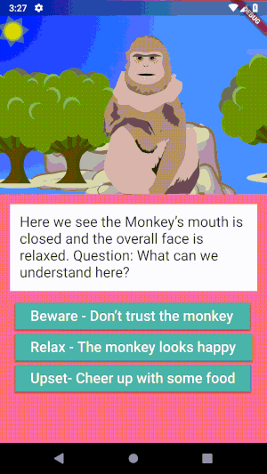

# talkmonkey

A simple Flutter application.

Hastily written one Saturday in response to a brief contributed by a local charity for the 'Girls In Tech' - 'Hacking for Humanity' Hackathon.

Showcases animations in Flutter using 2Dimentions tool 'Flare' released a week prior at Flutter IO.

More content here: [Presentation](./Team%20Banana%20(1).pdf)

